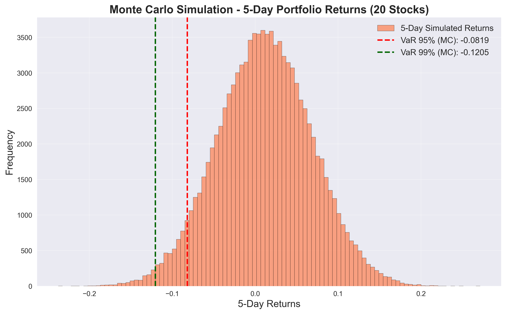

# Value at Risk (VaR) Estimation for Stock Portfolio

This project implements **Value at Risk (VaR)** estimation for a diversified portfolio of 20 major stocks using advanced financial modeling and data analytics. It showcases expertise in **financial risk management**, **data science**, and **machine learning**, bridging Finance and Computational techniques.

## Project Overview
- **Objective**: Estimate 1-day and 5-day VaR at 95% and 99% confidence levels for a portfolio of 20 stocks (AAPL, MSFT, GOOG, AMZN, NVDA, TSLA, META, JPM, V, MA, WMT, PG, KO, PEP, XOM, CVX, JNJ, PFE, BAC, C).
- **Methods**:
  - Historical Simulation
  - Variance-Covariance (Parametric) VaR
  - Monte Carlo Simulation (100,000 iterations)
  - GARCH(1,1) model for volatility forecasting
- **Portfolio Optimization**: Weights optimized using Sharpe Ratio maximization.
- **Data Source**: Historical stock prices from Yahoo Finance API (`yfinance`).
- **Output**: VaR estimates, volatility forecasts, and visualizations of loss distributions and correlation matrix.

## Technologies Used
- Python (NumPy, Pandas, Matplotlib, Seaborn, Arch)
- Yahoo Finance API

## Key Results
- **1-Day VaR**:
  - Historical VaR 95%: -3.84%
  - Parametric VaR 95%: -4.07%
  - Monte Carlo VaR 95%: -4.05%
  - GARCH VaR 95%: -2.57%
- **5-Day VaR**:
  - Historical VaR 95%: -8.30%
  - Parametric VaR 95%: -8.25%
  - Monte Carlo VaR 95%: -8.19%
- Optimized portfolio weights for 20 stocks to maximize risk-adjusted returns.
- Visualized correlation matrix to assess diversification across sectors.

## Visualizations
- 1-Day Monte Carlo VaR: 
- 5-Day Monte Carlo VaR: 
- Correlation Matrix: 

## How to Run
1. Clone the repository: `git clone https://github.com/MTeimouri85/Value-at-Risk-Portfolio.git`
2. Install dependencies: `pip install -r requirements.txt`
3. Run the script: `python var_estimation.py`

## Future Improvements
- Incorporate stress testing for macroeconomic scenarios (e.g., interest rate shocks).
- Add Expected Shortfall (CVaR) calculations.
- Extend to multi-asset classes (e.g., bonds, commodities).

---
Developed by [MAHSHID TEIMOURI] as a personal project to demonstrate skills in Finance, Risk Management, and Data Science.